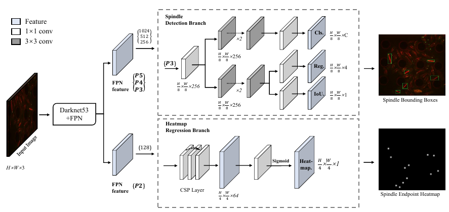
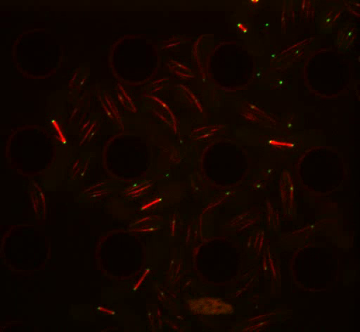
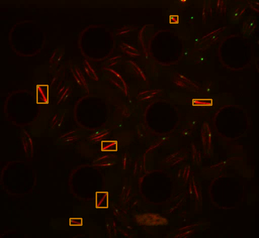
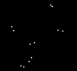

# YOLOX-SP

## Introduction
YOLOX-SP is based on YOLOX, if you not familiar with YOLOX, you can first look at the official code in [github](https://github.com/Megvii-BaseDetection/YOLOX) or consult this [documentation]("./README_yolox.md")

First, you need to refer to the YOLOX documentation to install the corresponding environment and make sure that YOLOX can run on it. Then, we will describe the usage of YOLOX-SP.

### 1. YOLOX-SP Architecture

We added a branch of Heatmap regression to YOLOX with the following model structure diagram.




### 2. Dataset Annotation

First, we preprocess the 16-bit tif image sequence and convert it to avi format. Then imported into CVAT for video tagging (Tracking box and pair points) and exported to cvat_video annotation form, whose dataset structure is shown in the following figure.
```bash
-dataset
|-images
|   |-frame_000002.PNG
|   |-...
|-annotation.xml
```

The format of the `annotation.xml` tag is shown below.
```xml
  <track id="0" label="microtubule" source="manual">
    <box frame="19" outside="0" occluded="0" keyframe="1" xtl="77.23" ytl="177.42" xbr="84.54" ybr="187.31" z_order="0">
    </box>
    <box frame="20" outside="0" occluded="0" keyframe="1" xtl="77.23" ytl="177.42" xbr="86.10" ybr="192.50" z_order="0">
    </box>
    ...
  </track>
  ...
  <track id="20" label="poles" source="manual">
    <points frame="59" outside="0" occluded="0" keyframe="1" points="81.10,131.70;93.70,236.60" z_order="0">
    </points>
    <points frame="60" outside="1" occluded="0" keyframe="1" points="81.10,131.70;93.70,236.60" z_order="0">
    </points>
  </track>
```

The tiny S.pombe dataset is release at [Google Drive](https://drive.google.com/drive/folders/1wbNVWJEVr-FFH9Znp1XXGf_kRbN-wMTL?usp=sharing)

We support single or multiple task dataset class:
- single task: `yolox/data/datasets/cvat_video.py`
- multiple task: `yolox/data/datasets/cvat_task.py`

### 3. Dataset Script
We re-wrote a Dataset loading script (whose script path is `yolox/data/datasets/cvat_video.py`) to apply to the loading of the cvat_video dataset. `__getitem__` returns the following data: Image, BBox, Mask as follows.


| Dataset | Image    |   BBoxes     | Mask[0]    |   Mask[1] |
| ------        |:---:              |:---:              |:---:              |:---:              |
|  visualize    || |  |  |


## Train Model
Once you have processed the data, you can train the model. First you need to set up the training set, validation set path, model parameters and other information under the exp file. exp file path: exps/microtubular/microtube_exp.py

Then you can just run:
```bash
python tools/train.py \
--experiment-name spindle_det \
--batch-size 4 \
--exp_file exps/microtubular/microtube_exp.py \
```


## Deploy Model

You can deploy the model (exported in ONNX format to provide inference to the SpindleTracker project) with the following runtime script.
```bash
python tools/export_onnx.py \
--exp_file exps/microtubular/microtube_exp.py \
--ckpt YOLOX_outputs/total_data/latest_ckpt.pth \
--dynamic
```
